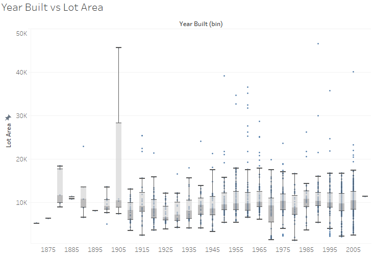
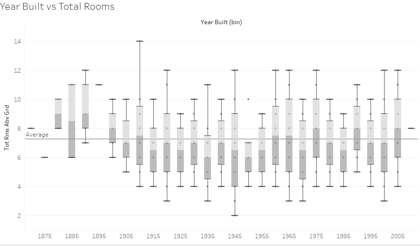
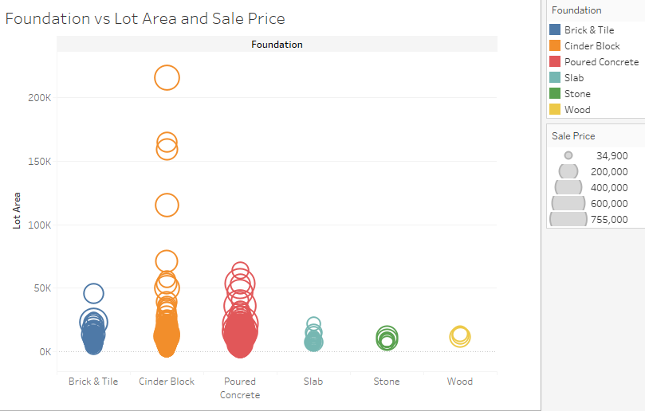
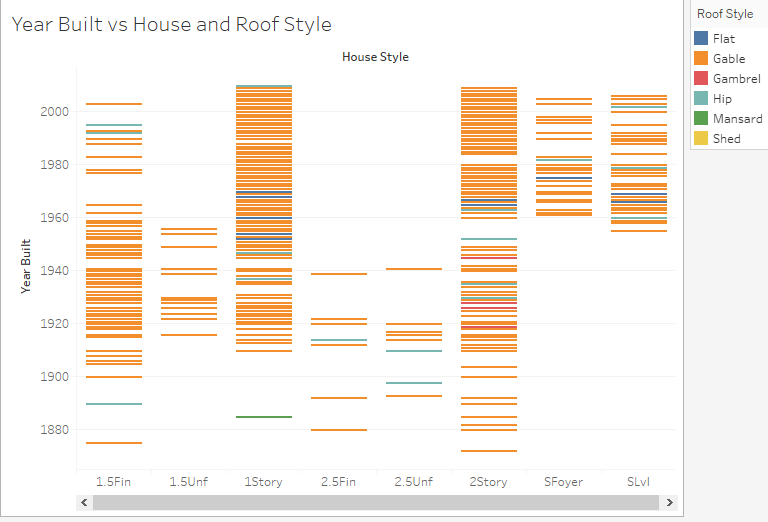
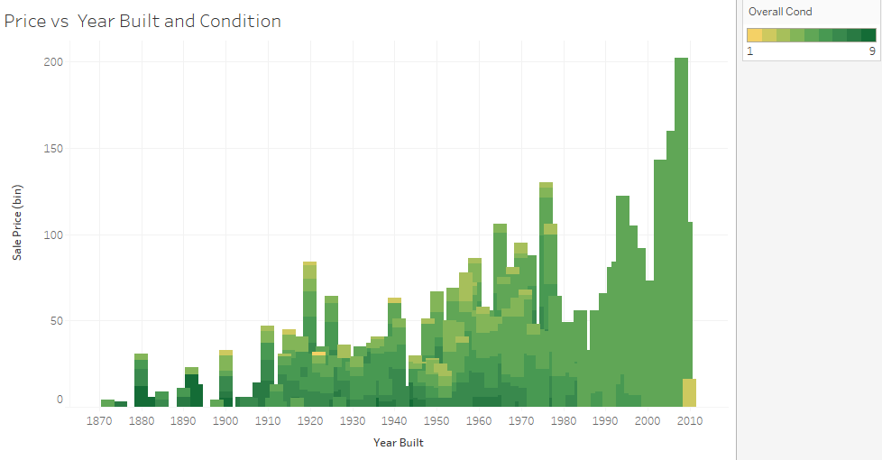

# Boston House Price Prediction <!-- omit in toc -->

Real-estate seems to be really hot currently, with a lot of people looking to make the most of the low interest rates to buy their dream house or invest for the future. 

#### -- Project Status: [Completed]

# Table of Contents <!-- omit in toc -->

- [Synopsis](#synopsis)
- [Dataset](#dataset)
  - [Summary of the Dataset](#summary-of-the-dataset)
  - [Exploratory Analysis](#eda)
- [Data Cleaning and Feature Engineering](#cleaning)
- [Model fitting and ensemble](#ensemble)
- [Conclusion](#conclusion)

# Synopsis 

The hosuing market has been really hot the past few years due to the really low interest rates. In the project we will train a supervised model to predict the house prices in Boston based on parameters such as number of rooms, area, year built, etc. 

We will use Tableau for the Exploratory analysis and ensembling techniques to predict the final prices!

# Dataset 

The datasets used for this part of the project can be found on Kaggle: 

https://www.kaggle.com/c/house-prices-advanced-regression-techniques

## Summary of the Dataset 

 - The dataset contains over 1460 records and 80 features. These features include things such as number of rooms, lot area and year the house was built.
 - The contains a number of missing and mis-labelled values. Any feature that has more than 80% values missing is removed. 

## Exploratory Analysis 

 - Tableau is a widely used software for data analysis, visualization and preparing dashboards. Data exploration for this project was conducted throught Tableau.
 
 - It is typically percieved that houses built in the earlier years had more rooms and were more spacious. This myth is busted as shown by the box-plots below.

  
  
  
  
- Sale price and building foundation do not seem to be too correlated, increasing lot size does increase the sale price as depicted by bigger circles. 

  

- Did a particular type of roof become old fashioned? Or did a certain style of house come in fashion? As seen from the plot below, Split Foyer and Split Level became more popular around the 1960's. Gable roof type is the most common across different years and house styles.

  

- We are all aware the historically, house prices have been going up. Lets instead try and compare the difference in prices of old and new houses and the condition they are sold in. It is interesting to note that there was a slight dip in the prices for houses built and sold during the economic crisis in 2008.

  
  
# Data Cleaning and Feature Engineering 

- The data contained a number of missing values for both numerical and categorical fields. The following methods were used to address the missing values:
  - Drop columns were majority of the values are missing
  - Drop columns were more almost all the values are of one category
  - Impute values based on linear regression, mean or mode depending on suitability 
- Feature engineering can add valuable information to the model by using exisiting features. Two new fewatures were created:
  - Age of the house
  - Total number of bathrooms
 - Categorical values are converted to numerical by using ordinal encoding and one hot encoding.    

## Model fitting and ensemble 
- Cross validation is used the ensure that the model is not overfitting on the data.
- The following regression models are used:
  - Light Gradient Boosting Regressor
  - XGBoost Regressor
  - Gradient Boosting Regressor
  - Random Forest Regressor
  - Stacking CV Regressor

- The resuls obtained are then plotted and best 3 models are using to create and ensemble which is used in making predictions.

## Conclusion 

A prediction RMSE of 0.133 is obtained. This can be further improved by conducting hyperparamter tuning and uisng more models in the ensemble. 

